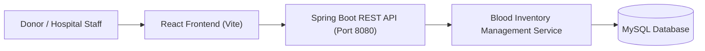
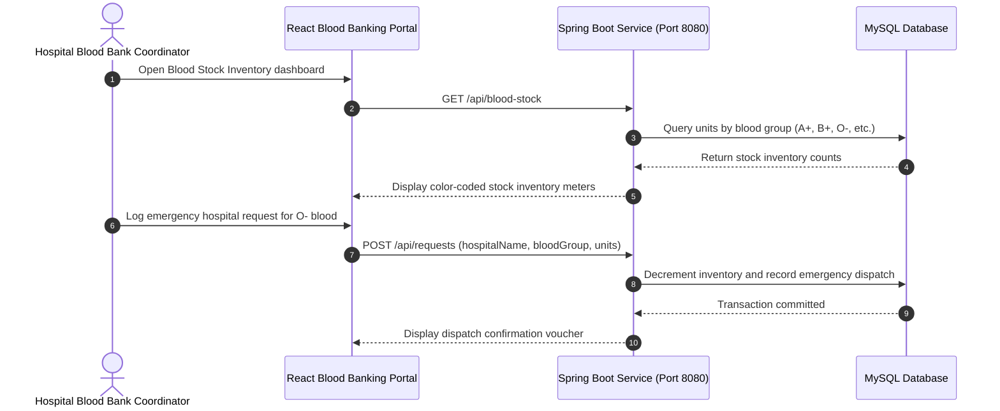

# Blood Bank Management System — CI/CD Lab Application
[]()
[]()
[]()
[]()

## Overview
A mission-critical full-stack Blood Banking System developed with Spring Boot (Java 17) and Vite + React. Designed to track blood donor registries, blood type inventory reserves (A+, B+, O+, AB+, etc.), hospital request dispatches, and emergency transfusion matching.

- **Problem Solved:** Real-time visibility and life-saving management of hospital blood inventory.
- **Target Users:** Blood bank coordinators, hospital staff, and voluntary donors.
- **Current Status:** Functional Lab Application.

## Features
- **Donor Registration & Tracking:** Log donor demographics, eligibility, and donation history.
- **Blood Stock Inventory:** Real-time tracking of units available by blood group.
- **Hospital Emergency Request:** Inbound hospital requests and fulfillment workflows.
- **Responsive Admin Panel:** Vite + React dashboard for blood bank operators.

## Architecture


## User Flow


## Technology Stack
| Layer | Technology | Purpose |
|---|---|---|
| Frontend | React, Vite, Tailwind CSS | Blood bank management interface |
| Backend | Java 17, Spring Boot 3 | Inventory logic and dispatch APIs |
| Database | MySQL 8.0 | Relational store for donors and inventory |
| Build Tool | Maven, npm | Build orchestration |

## Infrastructure
- **Frontend Port:** 5173
- **Backend Port:** 8080
- **Database Port:** 3306

## Project Structure
```text
Cicd-lab-2/
├── backend/
│   ├── src/main/java/       # Spring Boot source code (Donors, Inventory, Requests)
│   └── pom.xml              # Maven dependencies
├── frontend/
│   ├── src/                 # React UI components and state
│   ├── package.json         # Frontend packages
│   └── vite.config.js       # Vite configuration
├── .gitignore               # Git ignore definitions
└── README.md                # Technical documentation
```

## Prerequisites
- JDK 17
- Node.js >= 18.x
- MySQL Server 8.0

## Environment Variables
Configure backend database connection:
```properties
SPRING_DATASOURCE_URL=jdbc:mysql://localhost:3306/bloodbank_db
SPRING_DATASOURCE_USERNAME=root
SPRING_DATASOURCE_PASSWORD=your_mysql_password
```

## Local Development Setup
1. Clone the repository:
   ```bash
   git clone https://github.com/Bhanutejanallamothu/Cicd-lab-2.git
   cd Cicd-lab-2
   ```
2. Start Backend:
   ```bash
   cd backend
   ./mvnw spring-boot:run
   ```
3. Start Frontend:
   ```bash
   cd ../frontend
   npm install
   npm run dev
   ```
4. Access dashboard at `http://localhost:5173`.

## Docker Setup
*Not detected in repository.*

## Database Setup
```sql
CREATE DATABASE bloodbank_db;
```

## API Documentation
- `GET /api/blood-stock` - Returns unit counts by blood group.
- `POST /api/donors` - Registers a new donor and credits blood inventory.
- `POST /api/requests` - Submits hospital blood request.

## Deployment
Backend executable JAR deployment paired with static hosting for frontend.

## Security
- Input validation on donor blood parameters and medical eligibility.
- Sanitized SQL interactions via Spring Data JPA.

## Testing
```bash
cd backend && ./mvnw test
```

## Troubleshooting
- **Database Connection Failure:** Ensure MySQL service is active and user has schema privileges.

## Future Improvements
- Automated SMS alerts to registered donors during critical stock shortages.

## License
Academic / Lab project. All rights reserved by repository owner.
